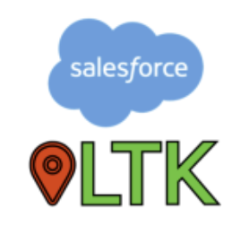
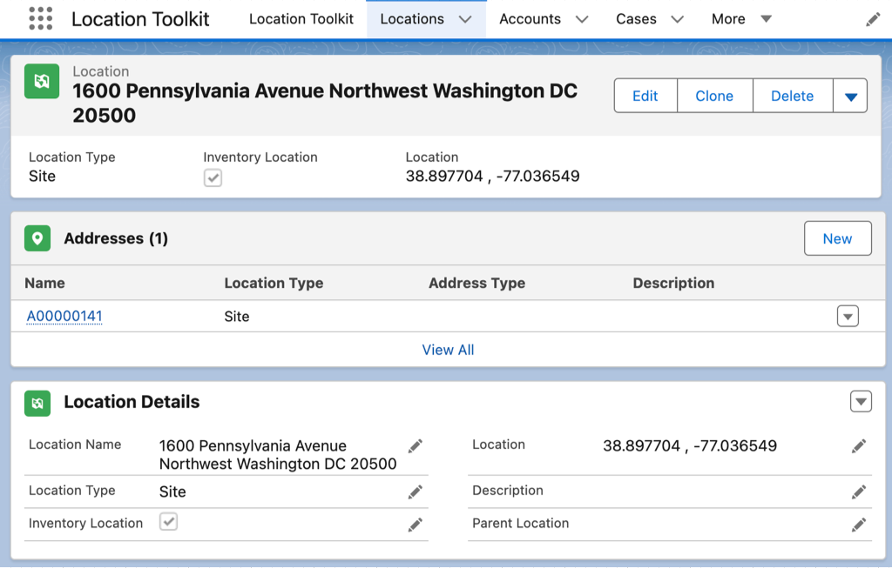
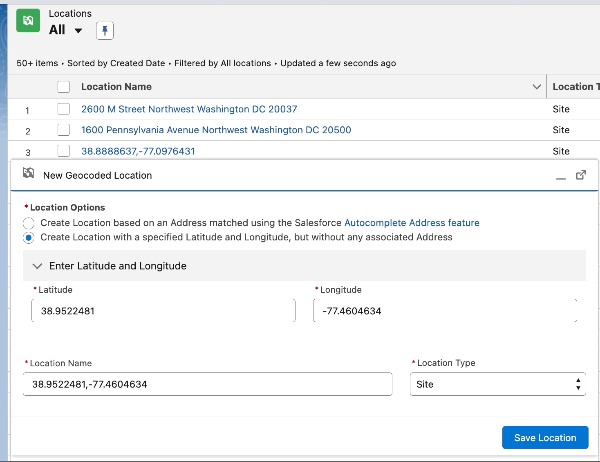
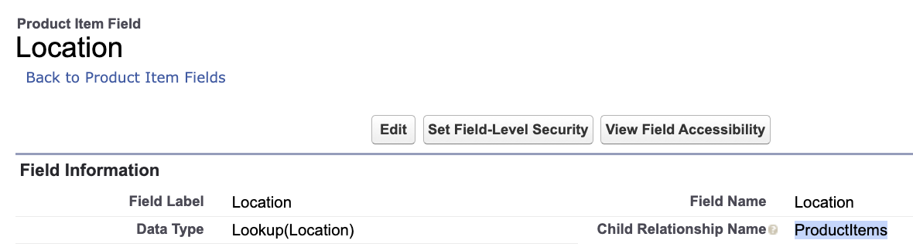
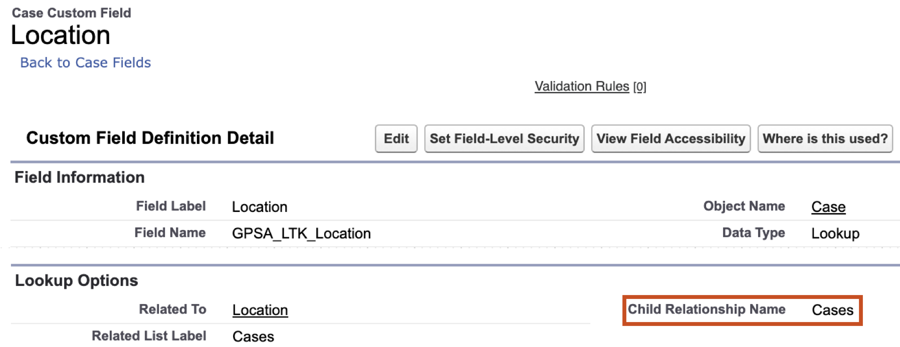
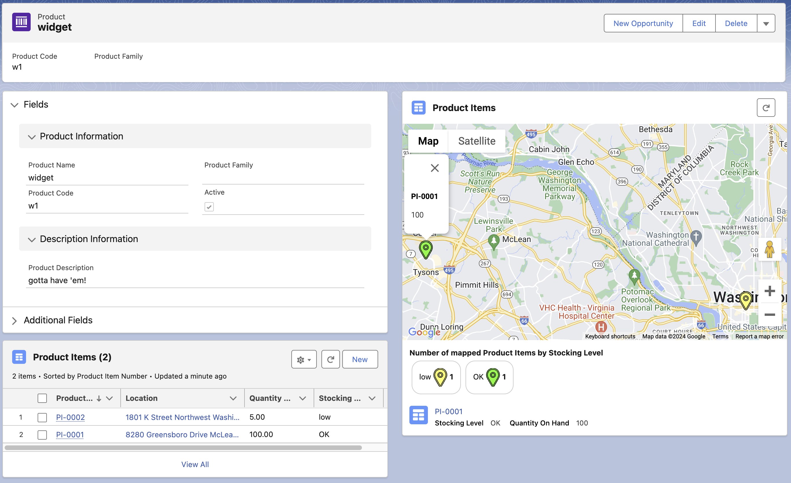
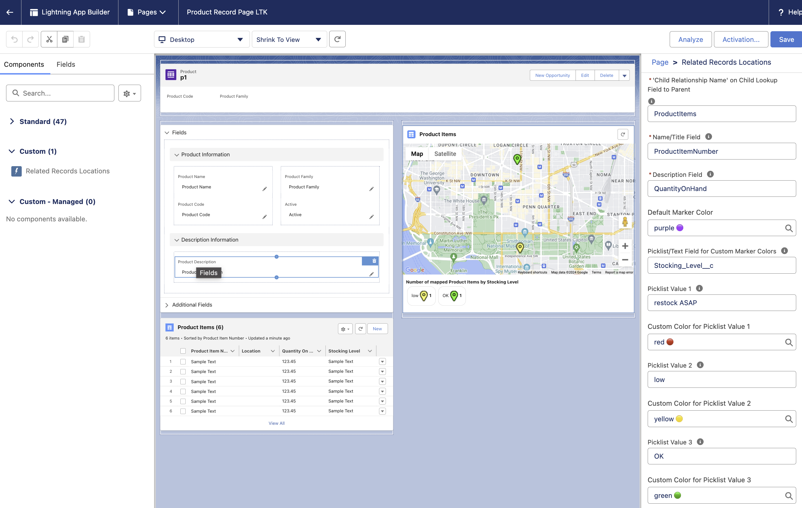
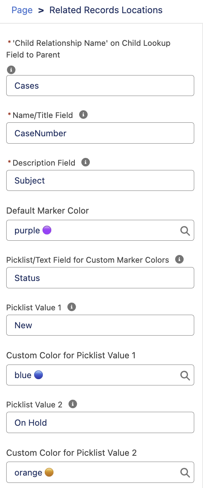

#  Location Toolkit (LTK)

**View related list records inside a Google Map component using reusable geocoded locations**

Accelerator Listing: [sfdc.co/LTK](http://sfdc.co/LTK)


## Description

Many people don't realize Salesforce has a [Location](https://developer.salesforce.com/docs/atlas.en-us.object_reference.meta/object_reference/sforce_api_objects_location.htm) object!

Location Toolkit (LTK) helps take advantage of that for capturing and mapping locations of child records related to a parent record, e.g. mapping Cases by Account or Incident, Product Items by Product, or similar parent-child relationships using any other pairing of standard or custom objects.

 in action")

Location Toolkit (LTK) is a mashup of a Related List and a Lightning Map. With LTK, users can easily assign geocoded locations to related Salesforce records and present them on a map to track, group and select them from their parent record’s page.

For example, map the locations of:
* Cases by Account or Incident
* Product Items by Product
* Assets by Contact
* Or any other pair of related objects you prefer!


**Key Features:**
* Easy creation of geocoded Location records using the included utility flow
* Human-friendly naming of Location records
    * Address (e.g. “1600 Pennsylvania Avenue Northwest Washington DC 20500”);
    * Lat/Long coordinates (e.g. “38.897714,-77.039121”); or
    * Whatever you prefer (e.g. “White House”)
* Location records are durable and reusable across any number of other related objects and records. Create your “White House” Location record once, then reuse that by associating it to other records (e.g. 4 cases, 10 assets) as needed and mapped accordingly across different parent records (Cases, Contacts, etc.).
* Optional color coding and counting of map markers for each related record set by a field value (e.g. Red for Status=Escalated, Blue for Status=New).
* No-code map solution that is straightforward to set up, configure, and use.


## Key Assets

This Accelerator includes the following assets:
* An **unmanaged package** (link below; metadata is also found in the [/force-app/main/default/](/force-app/main/default/) folder) that includes:
  * Application (1)
  * Custom objects (2)
  * Lightning Web Component (LWC) (1)
  * Flows (3)
* **Documentation**, including:
  * This readme file
  * [FURTHER_INFO.md](/docs/FURTHER_INFO.md), which covers:
    * more details on the data model used by LTK
    * compliance information regarding data flows to/from Google and the user's web browser. This is meant to advise CISO, CTO or other customer stakeholders who would like more background details for LTK suitability deployed on orgs requiring ATO review for FedRAMP or similar compliance standards.
    * release/version information


## Before You Install

**License Requirements**
* Public Sector Solutions, Health Cloud, or any other Salesforce industry cloud with access to the Address and Location objects (internal users), such that the [Address](https://developer.salesforce.com/docs/atlas.en-us.object_reference.meta/object_reference/sforce_api_objects_address.htm) object is enabled and available.  Basically, a user needs at least Read access to Address and Location objects.

**Accelerator or Technology-Specific Assumptions**
* [Address Autocompletion](https://help.salesforce.com/s/articleView?id=sf.customize_maps_autocomplete.htm&type=5) is enabled (Setup → Company Settings → Maps and Location Settings).
* Visit Inventory Management is enabled (Setup → Inventory Settings).
* Lightning Web Security is enabled (Setup → Security → Session Settings).

**General Assumptions**
* You are using this Accelerator in a sandbox or test environment. It is recommended that you not install any Accelerator directly into production environments.
* Example: If you do not have a Salesforce org licensed to you, try one of our industry solutions for free with one of our [trial environments](https://gpsaccelerators.developer.salesforce.com/trials).
* You are using this Accelerator in conjunction with the Salesforce Lightning Experience (LEX) - not the Classic UI.


## Installation

Unmanaged package installation link: **[https://test.salesforce.com/packaging/installPackage.apexp?p0=04ta5000009SwNF&isdtp=p1](https://test.salesforce.com/packaging/installPackage.apexp?p0=04ta5000009SwNF&isdtp=p1)**

**1. Log in to Your Salesforce Environment:**
   * Use the installation link provided above to log in to your Salesforce sandbox environment.
   * Note: If installing in a production org, replace test.salesforce.com with login.salesforce.com in the installation URL.

**2. Install the Package:**
   * On the installation page, select "Install for Admins Only".
   * Under the section "What if existing component names conflict with ones in this package?", choose an option that aligns with your implementation requirements. This will determine how the package handles naming conflicts with existing components.


## Post-Install Setup & Configuration

[Required. Steps necessary for using the Accelerator. This can include images/screenshots which must be stored in the /docs/ folder (no external images or images stored elsewhere in the repository.]

High-level steps for using LTK:
1. [Create Location records](#create-location-records)
2. [Use or create Location lookup fields](#use-or-create-a-location-lookup-field) on objects for which one wants to track location (e.g. Case, Product Item, a custom object)
3. [Use the "Related Records Locations" LWC](#use-the-related-records-locations-lwc) to render locations of such records under a parent object, rendering a record related list on a Google Map

### Create Location Records

Use the New Geocoded Location utility item in the Location Toolkit app.  This utility runs the [Geocoded_Location_Creator](./force-app/main/default/flows/Geocoded_Location_Creator.flow-meta.xml) screen flow, which one can also add as a Utility Item into any other Salesforce app’s configuration.

#### Creating Address-Based Locations

This is the default option in the utility leveraging [Address Autocompletion](https://help.salesforce.com/s/articleView?id=sf.customize_maps_autocomplete.htm&type=5). Users may need to wait for a few seconds for the Address field to become visible to take advantage of Address Autocompletion. This delay nay occur while Salesforce is waiting for the Google Maps API to initialize.

Using the Address option is recommended because Autocompleted addresses should be valid, geocoded, and fully formed automatically. Although if a user already have a valid full address on hand, they can enter that information manually in the Street, City, etc. fields without waiting for the Address field to appear.


When saved, this creates 2 related records actually - a parent Location record and a child Address record.  

> [!NOTE]
> <details>
> <summary>👈 click to see Sample Location Record with child Address</summary>
>
> 
> </details>

It is recommended that one names the Location record based on its Address string, which is easily enabled by clicking the checkbox “Automatically Name New Location using this Address”.

#### Creating Latitude/Longitude-Based Locations

For Location records that require Lat/Long coordinates, e.g. if no Street address exists at that location, one can directly enter those coordinates instead by selecting option "Create Location with a specified Latitude and Longitude, but without any associated Address".

Users also need to specify a particular name for this Location, which can be the actual coordinates or any other text string. Note also that obviously this type of Location record will not have any child Address record.




### Use or Create a Location Lookup Field

Any Salesforce object can then be linked to a location for its records merely by having a Location lookup field.  Some standard objects like [Product Item](https://developer.salesforce.com/docs/atlas.en-us.object_reference.meta/object_reference/sforce_api_objects_productitem.htm?q=LocationId) or [Asset](https://developer.salesforce.com/docs/atlas.en-us.object_reference.meta/object_reference/sforce_api_objects_asset.htm) already have a LocationId (lookup) field.  



So for custom or standard objects without a Location reference field, create a custom Location lookup field. Below is an example of a custom Location field added to Case already included in the LTK package.




### Use the "Related Records Locations" LWC

After one has a child object with a Location field and some records of that object added/updated with a Location, users can then view those records on a map with the Related Records Locations lightning web component.  Some examples shown above for this are already configured in the Location Toolkit application.



The Related Records Locations LWC is essentially a type of Related List that can be shown on a parent object’s record page. How to set the different parameters for this component is described below.



#### Required Parameters

##### Child Relationship Name (Required)

This is found in the Location lookup field configured on the child object.  See the highlighted areas of the images in the [Use or create a lookup field to Location](#use-or-create-a-location-lookup-field) section above for reference.

So for ProductItem’s Location field, this parameter is _ProductItems_. For a custom Location field like Case.Location__c defined in the LTK package, this parameter is _Cases_.

For other custom Location fields, this parameter will be defined by the Salesforce administrator creating that custom Lookup field.  The default value should be the plural form of the child object’s name.

> [!IMPORTANT]
> This parameter _must_ be set correctly for the Related Records Locations lightning web component to function properly.

##### Name/Title Field (Required)

This can be any text or text formula field on the child object. The Name field if one exists is recommended, or for a Case this can be a field like CaseNumber.  If a user clicks on a map marker, this field is also shown in bold in the bubble above that marker on the map, and is shown beneath the key section under the map.

> [!NOTE]
> <details>
> <summary>👈 click to see Rendered Example (ProductItem.ProductItemNumber)</summary>
>
> ")
> </details>

##### Description Field (Required)

This can be any text or text formula field on the child record.  For Case this can be a field like Subject. If a user clicks on a map marker, this field is also shown in plain text in the bubble above that marker on the map, and is shown beneath the key section under the map.

> [!NOTE]
> <details>
> <summary>👈 click to see Rendered Example (Case.Subject)</summary>
>
> ")
> </details>

##### Default Marker Color

Select the default color that will be used when a record is otherwise not covered by Custom Marker Colors below.

##### Picklist/Text Field for Custom Marker Colors

This can be any text, text formula or picklist field.  This field should be expected to have specific values to map to specific colors that one assigns to the remaining parameters below.  A good example for this is Status for a Case.  If a user clicks on a map marker, this field is also show beneath the key section under the map.

##### Picklist Value 1/2/3/4/5

Select the value for the Picklist/Text Field for Custom Marker Colors parameter field can be assigned a custom color. This parameter will also be shown in the key section under the map counting the number of matching records.

##### Custom Color for Picklist Value 1/2/3/4/5

Select the color for any record whose value for its Picklist/Text Field for Custom Marker Colors parameter matches the value set in the corresponding Picklist Value parameter.

> [!NOTE]
> <details>
> <summary>👈 click to see example configuration for all parameters above</summary>
>
> 
> </details>


## FAQs

**_Q: In the Geocoded Location utility item, regarding the 🪧 Please wait for ⬇️ Enter Address to Lookup using Address Autocompletion field ⬇️ to appear below... ⏱️, what if that field never appears for users?_**

A: The user's web browser may not be loading the javascript file(s) for the Salesforce mapsloader or Google Maps API.  Try adding these base URLs to the CORS and Trusted URLs settings in Salesforce Setup.  The Trusted URLs should also have CSP Context set to All and connect-src (scripts) checked.  After adding these, affected users should clear their browser's cache as well and/or log out & back into Salesforce.

```generic
https://maps.googleapis.com
https://maps.a.forceusercontent.com
https://maps.b.forceusercontent.com
```

Also the user may not have allowed Location permissions for the site settings of their Salesforce org in their browser.  For that user's browser (Chrome, Firefox, Edge, etc), check online documentation for changing a site's Location privacy/security settings to Allow.

**_Q: What about [Salesforce Maps](https://www.salesforce.com/sales/mapping-software/)?_**

A: Overall LTK is meant to be a focused, tactical utility for creating specific Location records and viewing those locations on a Map as a complement to standard Salesforce record related lists. Salesforce Maps does not offer a feature for mapping of record related list(s) as well. One can use LTK with Salesforce Maps as a complementary add-on if desired. Furthermore, Salesforce Maps is a licensed product whereas LTK as a Salesforce Accelerator is [free and open-source](./LICENSE).

**_Q: How does the Related Records Locations LWC handle child records that don't have a value for their Location field?_**

A: It doesn't try to render those on its Google Map.  So if there are least some related records with locations, it will just render those on its map.  Or if there only related records each without a location, the lwc will just output a message "Records without locations are not mapped" and not render a (blank) map.

## Additional Resources

* See [FURTHER_INFO.md](/docs/FURTHER_INFO.md) for:
  * more details on the data model used by LTK
  * compliance information regarding data flows to/from Google and the user's web browser. This is meant to advise CISO, CTO or other customer stakeholders who would like more background details for LTK suitability deployed on orgs requiring ATO review for FedRAMP or similar compliance standards.
  * release/version information
* [Address](https://developer.salesforce.com/docs/atlas.en-us.object_reference.meta/object_reference/sforce_api_objects_address.htm) object


## Revision History

**1.944 Initial release (28 Jul 2025)** - First public release!


## Acknowledgements

Accelerator Build Team
- **[Brian Coughlin](https://www.linkedin.com/in/coughlin/)**, Distinguished Solution Engineer, Salesforce

Beta Testing
- **[Manuel Mastromanolis](https://www.linkedin.com/in/mnmastromanolis/)**, Lead Solution Engineer, Salesforce
- **[Robyn Rowley](https://www.linkedin.com/in/robyn-rowley-013/)**, Principal Solution Engineer, Salesforce

Accelerator Program Support
- **[Mitch Lynch](https://www.linkedin.com/in/rmitchlynch/)**, Distinguished Solution Engineer, Salesforce
- **[Nicole Peters](https://www.linkedin.com/in/nicole-peters-aa723657/)**, Principal Solution Engineer, Salesforce


## Terms of Use

Thank you for using Global Public Sector (GPS) Accelerators.  Accelerators are provided by Salesforce.com, Inc., located at 1 Market Street, San Francisco, CA 94105, United States.

By using this site and these accelerators, you are agreeing to these terms. Please read them carefully.

Accelerators are not supported by Salesforce, they are supplied as-is, and are meant to be a starting point for your organization. Salesforce is not liable for the use of accelerators.

For more about the Accelerator program, visit: [https://gpsaccelerators.developer.salesforce.com/](https://gpsaccelerators.developer.salesforce.com/)