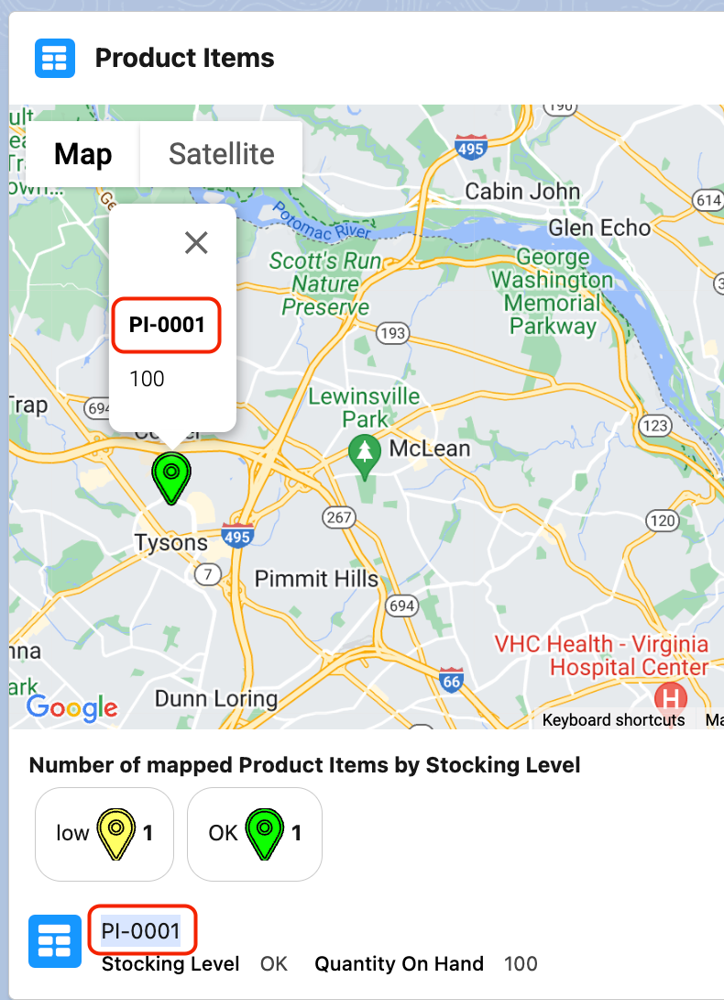
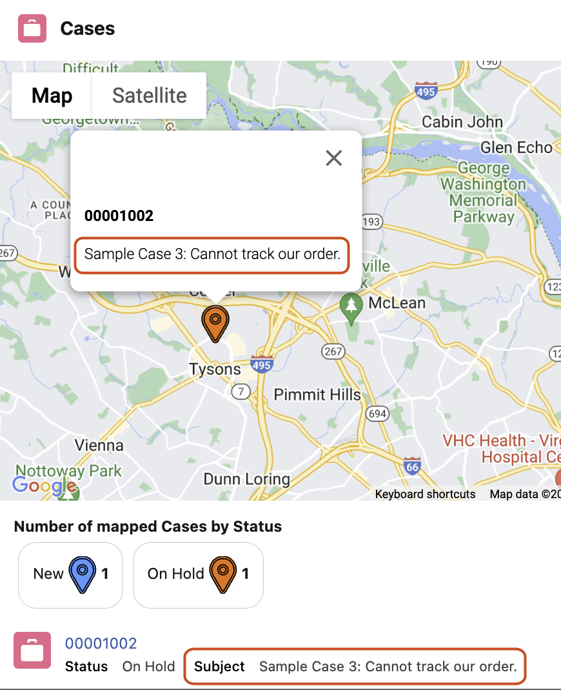

<h1> Location Toolkit</h1>

 in action")

Accelerator Listing: [sfdc.co/LTK](http://sfdc.co/LTK) 

## About Location Toolkit

Many people don't realize Salesforce has a [Location](https://developer.salesforce.com/docs/atlas.en-us.object_reference.meta/object_reference/sforce_api_objects_location.htm) object! 

Location Toolkit (LTK) helps take advantage of that for capturing and mapping locations of child records related to a parent record, e.g. mapping Cases by Account or Incident, Product Items by Product, or similar parent-child relationships using any other pairing of standard or custom objects.

## High-level Steps for LTK
1. [Install LTK](#installation) making sure the target org has [required feature(s) & licensed users](#before-installing)
2. [Create Location records](#create-location-records)
3. [Use or create a Location lookup field](#use-or-create-a-location-lookup-field) on object for which one wants to track location, e.g. Case, Product Item, a custom object, etc
4. [Use "Related Records Locations" LWC](#use-related-records-locations-lwc) to render locations of such records under a parent object, rendering a record related list on a Google Map 

## Before Installing
### LTK org requirements:
1. A Salesforce Industry Cloud license, e.g. Public Sector Solutions, Health Cloud, Education Cloud, etc. such that the [Address](https://developer.salesforce.com/docs/atlas.en-us.object_reference.meta/object_reference/sforce_api_objects_address.htm) object is enabled and available
2. [Address Autocompletion](https://help.salesforce.com/s/articleView?id=sf.customize_maps_autocomplete.htm&type=5) is enabled in the org
3. Enable Visit Inventory Management under Setup → Inventory Settings
4. Lightning Web Security Enabled
5. Salesforce Lightning Experience (LEX) enabled, i.e. Classic UI not supported

### License(s) Required
* Internal Users with assigned Public Sector Solutions, Health Cloud, or similar Industry Cloud permission set license(s). Basically a user needs at least Read access to Address and Location objects.

### General Assumptions/Best Practices
* Install this Accelerator first in a sandbox or test environment. It is not recommended that one install any Accelerator directly into production environments.
* If one does not already have a suitable Salesforce org, consider a Public Sector Solutions [trial environment](https://developer.salesforce.com/free-trials/comparison/public-sector) which can be activated in minutes.

## Installation

* Production install: [https://login.salesforce.com/packaging/installPackage.apexp?p0=04ta5000000k7jF](https://login.salesforce.com/packaging/installPackage.apexp?p0=04ta5000000k7jF&isdtp=p1)
* Sandbox install: [https://test.salesforce.com/packaging/installPackage.apexp?p0=04ta5000000k7jF&isdtp=p1](https://test.salesforce.com/packaging/installPackage.apexp?p0=04ta5000000k7jF&isdtp=p1)

Version Number: 1.942\
Version Name: LTK RC version 1.09-42\
Package ID: 04ta5000000k7jF\
Package type: Unmanaged 1GP

## Post-Install Setup & Configuration

### Create Location records
Use the New Geocoded Location utility item in the Location Toolkit app.  This utility runs the [Geocoded_Location_Creator](./force-app/main/default/flows/Geocoded_Location_Creator.flow-meta.xml) screen flow, which one can also add as a Utility Item into any other Salesforce app’s configuration.

#### Creating Address-based Locations

This is the default option in the utility leveraging [Address Autocompletion](https://help.salesforce.com/s/articleView?id=sf.customize_maps_autocomplete.htm&type=5). Users may need to wait for a few seconds for the Address field to become visible to take advantage of Address Autocompletion. This delay nay occur while Salesforce is waiting for the Google Maps API to initialize.

Using the Address option is recommended because Autocompleted addresses should be valid, geocoded, and fully formed automatically. Although if a user already have a valid full address on hand, they can enter that information manually in the Street, City, etc. fields without waiting for the Address field to appear.

When saved, this creates 2 related records actually - a parent Location record and a child Address record.  

> [!NOTE]
> 

> 
👈 click to see Sample Location Record with child Address

> 
> 
> 

It is recommended that one names the location record based on its Address string, which is easily enabled by clicking the checkbox “Automatically Name New Location using this Address”.

#### Creating Latitude/Longitude-based Locations

For Location records that require Lat/Long coordinates, e.g. if no Street address exists at that location, one can directly enter those coordinates instead by selecting option "Create Location with a specified Latitude and Longitude, but without any associated Address".

Users also need to specify a particular name for this Location, which can be the actual coordinates or any other text string. Note also that obviously this type of Location record will not have any child Address record.

### Use or Create a Location lookup field

Any Salesforce object can then be linked to a location for its records merely by having a Location lookup field.  Some standard objects like [Product Item](https://developer.salesforce.com/docs/atlas.en-us.object_reference.meta/object_reference/sforce_api_objects_productitem.htm?q=LocationId) or [Asset](https://developer.salesforce.com/docs/atlas.en-us.object_reference.meta/object_reference/sforce_api_objects_asset.htm) already have a LocationId (lookup) field.  

So for custom or standard objects without a Location reference field, create a custom Location lookup field. Below is an example of a custom Location field added to Case already included in the LTK package.

### Use "Related Records Locations" Lightning Web Component
After one has a child object with a Location field and some records of that object added/updated with a Location, users can then view those records on a map with the Related Records Locations lightning web component.  Some examples shown above for this are already configured in the Location Toolkit application.

## Configuring the Related Records Locations lightning web component

The Related Records Locations lightning web component is essentially a type of Related List that can be shown on a parent object’s record page. How to set the different parameters for this component is described below.

### Required Parameters

#### Child Relationship Name

This is found in the Location lookup field configured on the child object.  See the highlighted areas of the images in the [Use or create a lookup field to Location](#use-or-create-a-location-lookup-field) section above for reference.

So for ProductItem’s Location field, this parameter is _ProductItems_. For a custom Location field like Case.Location__c defined in the LTK package, this parameter is _Cases_. 

For other custom Location fields, this parameter will be defined by the Salesforce administrator creating the custom Lookup field.  The default value is should be the plural form of the child object’s name.

> [!IMPORTANT]
> This parameter *must* be set correctly for the Related Records Locations lightning web component to function properly.

#### Name/Title Field

This can be any text or text formula field on the child object. The Name field if one exists is recommended, or for a Case this can be a field like CaseNumber.  If a user clicks on a map marker, this field is also shown in bold in the bubble above that marker on the map, and is shown beneath the key section under the map.

> [!NOTE]
> 

> 
👈 click to see Rendered Example (ProductItem.ProductItemNumber)

> 
> 

#### Description Field

This can be any text or text formula field on the child record.  For Case this can be a field like Subject. If a user clicks on a map marker, this field is also shown in plain text in the bubble above that marker on the map, and is shown beneath the key section under the map.

> [!NOTE]
> 

> 
👈 click to see Rendered Example (Case.Subject)

> 
> 

### Other Parameters

#### Default Marker Color

Select the default color that will be used when a record is otherwise not covered by Custom Marker Colors below.

#### Picklist/Text Field for Custom Marker Colors

This can be any text, text formula or picklist field.  This field should be expected to have specific values to map to specific colors that one assigns to the remaining parameters below.  A good example for this is Status for a Case.  If a user clicks on a map marker, this field is also show beneath the key section under the map.

#### Picklist Value 1/2/3/4/5

Select the value for the Picklist/Text Field for Custom Marker Colors parameter field can be assigned a custom color. This parameter will also be shown in the key section under the map counting the number of matching records. 

#### Custom Color for Picklist Value 1/2/3/4/5

Select the color for any record whose value for its Picklist/Text Field for Custom Marker Colors parameter matches the value set in the corresponding Picklist Value parameter.

> [!NOTE]
> 

> 
👈 click to see example configuration for all parameters above

> 
> 

## Included Assets in the package

For full details, see contents of [./force-app/main/default/](./force-app/main/default/) folder

LTK includes the following assets:
- Application (1)
- Custom objects (2)
- Custom fields on standard objects 
- Lightning Web Component (LWC): Related Records Locations
- Flows (3)
  - Geocoded Location Creator
  - LTKInfo
  - PushAddressLatLongToItsParentLocation
- Lightning Pages (Flexipages) (7)
  - Account_Record_Page_LTK
  - Case_Record_Page_LTK
  - Location_Recpage_LTK
  - Location_Toolkit
  - Location_Toolkit_UtilityBar
  - Parent_Test_Object_Record_Page
  - Product_Record_Page
- Documentation, including:
  - This [Readme file](./README.md)
  - [Further Information](./FURTHER_INFO.md)

## FAQs

**_Q: What about [Salesforce Maps](https://www.salesforce.com/sales/mapping-software/)?_**

A: Overall LTK is meant to be a focused, tactical utility for creating specific Location records and viewing those locations on a Map as a complement to standard Salesforce record related lists. Salesforce Maps does not offer a feature for mapping of record related list(s) as well. One can use LTK with Salesforce Maps as a complementary add-on if desired. Furthermore, Salesforce Maps is a licensed product whereas LTK as a Salesforce Accelerator is [free and open-source](./LICENSE).

**_Q: How does the Related Records Locations lwc handle child records that don't have a value for their Location field?_**

A: It doesn't try to render those on its Google Map.  So if there are least some related records with locations, it will just render those on its map.  Or if there only related records each without a location, the lwc will just output a message "Records without locations are not mapped" and not render a (blank) map.

## Additional Resources

See [further information](./FURTHER_INFO.md) for 
* more details on the data model used by LTK
* compliance information regarding data flows to/from Google and the user's web browser. This is meant to advise CISO, CTO or other customer stakeholders who would like more background details for LTK suitability deployed on orgs requiring ATO review for FedRAMP or similar compliance standards.
* release/version information

## Acknowledgements

1. Program Support & Management: Mitch Lynch and Nicole Peters
2. Testing: Robyn Rowley & Manuel Mastromanolis

## Terms of Use

Thank you for using Global Public Sector (GPS) Accelerators.  Accelerators are provided by Salesforce.com, Inc., located at 1 Market Street, San Francisco, CA 94105, United States.

By using this site and these accelerators, you are agreeing to these terms. Please read them carefully.

Accelerators are not supported by Salesforce, they are supplied as-is, and are meant to be a starting point for your organization. Salesforce is not liable for the use of accelerators.

For more about the Accelerator program, visit: [https://gpsaccelerators.developer.salesforce.com/](https://gpsaccelerators.developer.salesforce.com/)

